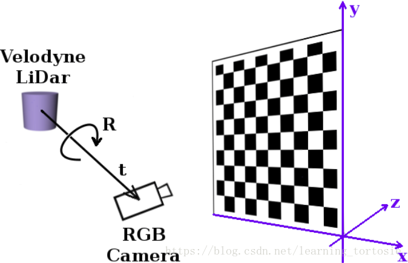
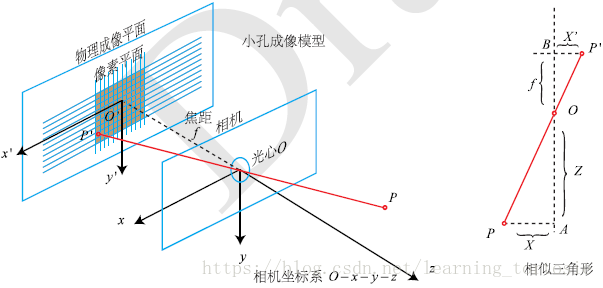
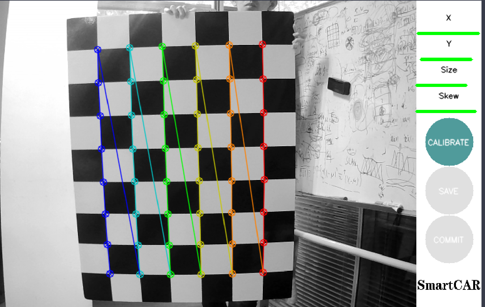
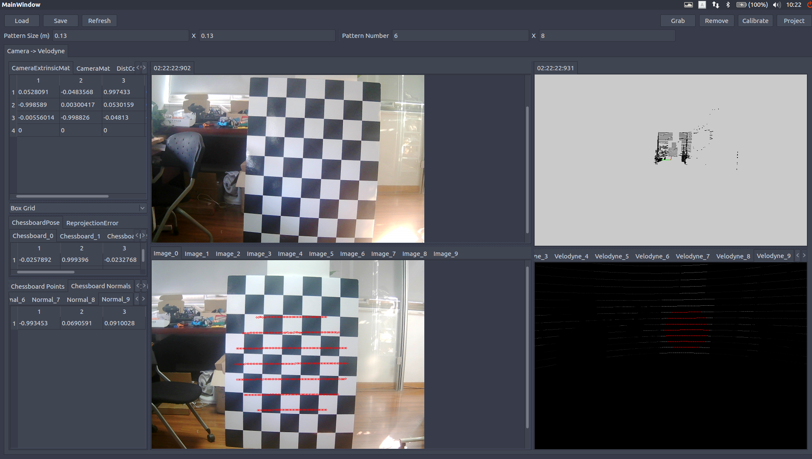
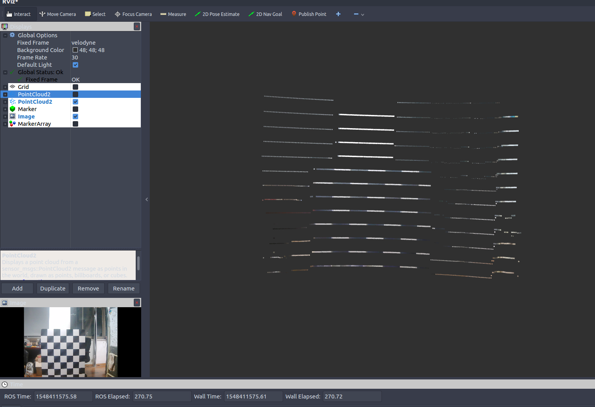
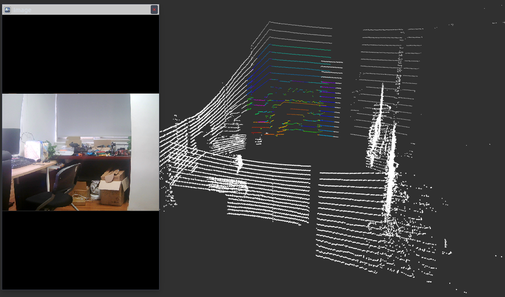
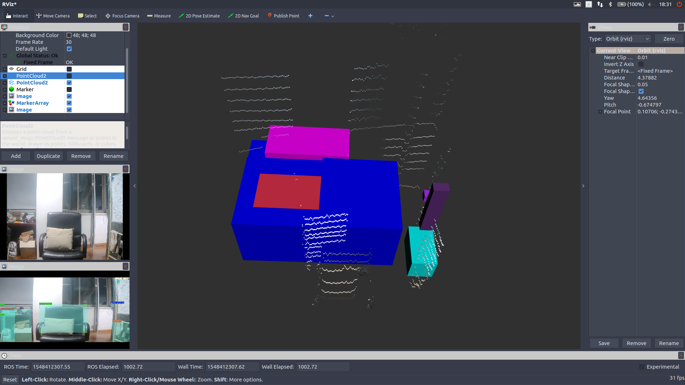
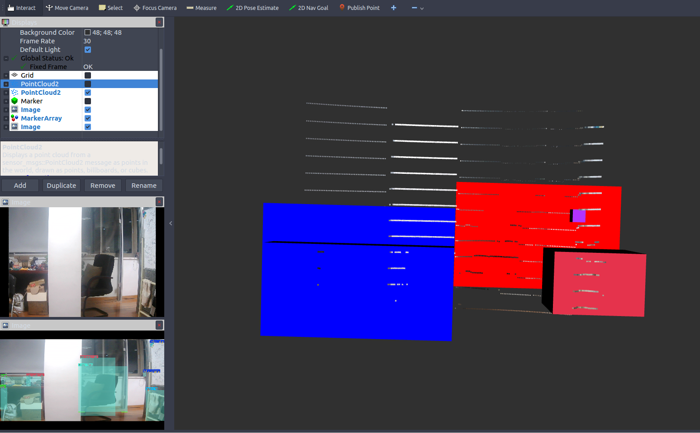
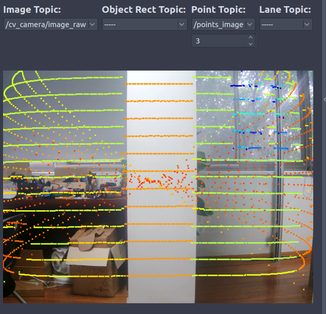
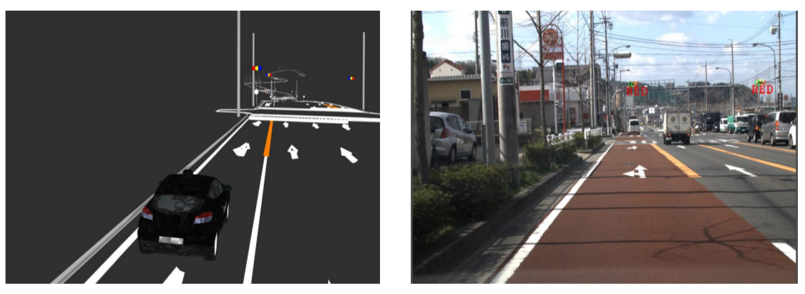

## 视觉激光雷达信息融合与联合标定

### 一、引言

最近在为车辆添加障碍物检测模块，障碍物检测可以使用激光雷达进行物体聚类，但是我们使用的是16线的velodyne，线数还是有些稀疏，对于较远的物体过于稀疏的线数聚类效果并不好，因此考虑使用视觉进行目标检测，然后投影到3D点云里面，获取障碍物位置，同时视觉还可以给出障碍物类别信息。

使用视觉进行目标检测，将检测结果2D bounding box坐标信息投影到点云里面获得3D bounding boxx坐标，这里面需要将摄像头和激光雷达进行联合标定，即获取二者坐标系的空间转换关系。

相关代码已经同步到我的github-smartcar,标定部分在detection/calibration文件夹,  信息融合部分在detection/camera_point_fusion

### 二、联合标定转换关系

联合标定的作用就是建立点云的point和图像pixel之间的对应关系，

需要获取相机与激光雷达外参，将点云3维坐标系下的点投影到相机3维坐标系下。还需要通过相机标定获得相机内参，这个是把相机3维坐标系下的点投影到成像平面。具体如下所示：



上图显示的就是联合标定得到的4×4转换矩阵的作用，将我们的3D点云转换到相机坐标系下面



这幅图显示了相机坐标系和成像坐标系的关系，相机标定会得到相机内参矩阵和畸变系数，畸变系数可以消除相机凸透镜的畸变效应，相机内参的信息就可以想相机坐标下的3维点投影到2维的像素平面。相机标定的具体原理可以参考 https://zhuanlan.zhihu.com/p/30813733

### 三、相机标定

需要一个标定板，要硬质板或者泡沫的标定板，因为标定板的平面要保证是平的。标定板的文件可以到opencv官网下载。

首先做相机标定，相机标定模块在detection/calibration/camera_calibration

编译
```
cd your_rosworkspace_path/
catkin_make -DCATKIN_BLACKLIST_PACKAGES=ndt_mapping;static_map;ndt_localization
```
这里我们先不编译ndt_mapping;static_map;ndt_localization这三个软件包


如果出错，可以先编译消息文件，再编译全部文件：
```
catkin_make -DCATKIN_WHITELIST_PACKAGES=smartcar_msgs;yunle_msgs;smartcar_config_msgs
catkin_make -DCATKIN_WHITELIST_PACKAGES=“”
```
然后要修改detection/calibration/camera_calibration/nodes文件夹下面python文件的可执行权限：
```
sudo chmod a+x your_path/detection/calibration/camera_calibration/.
```
启动摄像头驱动节点
```
roslaunch cv_camera cv_camera_driver.launch
```
这里注意你自己的摄像头video_id，使用如下命令查看
```
ls /dev/video*
```
然后根据需要修改your_path/driver/cv_camera/launch/cv_camera_driver.launch里面的
```
<param name="device_id" type="int" value="1" />
```
新开一个终端，执行
```
rosrun calibration cameracalibrator.py --square 0.13 --size 8x6 image:=/cv_camera/image_raw
```
然后就可以进行标定了，弹出的界面如下所示：



需要做的就是移动标定版，让右上角的四个条都变绿(我这里绿的是已经调好了，未调整是偏黄色)

x代表左右移动，y代表上下移动，size代表远近移动，skew代表倾斜侧角，可以上下倾，也可以左右倾。

只有四个尺度的信息都满足要求之后，右侧的calibration图标才会显示出来，这时候代表可以计算标定结果了，点击calibration，然后save，标定结果会保存在home文件夹下面。

### 四、联合标定

联合标定使用的是autoware的CalibrationTookit模块，代码在detection/calibration/calibration_camera_lidar文件夹下面

编译好代码之后，首先要启动摄像头和激光雷达的驱动节点
```
roslaunch cv_camera cv_camera_driver.launch
```
新终端
```
roslaunch velodyne_pointcloud VLP16_points.launch
```
然后驱动联合标定节点
```
roslaunch calibration_camera_lidar camera_lidar_calib.launch
```
启动之后可以看到UI界面，具体操作指南，可以参考文档：
detection/calibration/calibration_camera_lidar/CalibrationToolkit_Manual.pdf 的2.3节

也可以参考链接
https://blog.csdn.net/AdamShan/article/details/81670732#commentBox

如何使用这个模块上面的链接已经说的很明白，这里简单说一下：
- 首先左上角load之前标定的相机内参文件，导入相机内参

- 调整点云的视角(操作方法参考上面链接)，然后确保图像和点云都可以看到完整的白标定板，点击右上角的grab捕获单帧图片和点云

- 在捕获单帧的点云上面，选取图片中对应标定板的位置，选取的是圆圈内的所有点，所包含的信息不仅仅只有点，还有平面法相量，标定的时候一定要确保法相量与平面是垂直的，因为开始我没有注意这个，结果后面验证的时候投影点在图片上显示不出，根本没有投影在图像范围内。

标定好之后，在右上角有一个project，可以查看标定的效果，一般来将，可以看到如下效果：



左下角图片上的红线就是右下角点云红线投影到图片上的位置，下面这幅图片换一个角度，点同样投影上去，而且相对位置在点云和图片里面基本一致：


这样的效果基本就是可以了，点击save，会将输出的外参文件保存在home文件夹下面。

### 五、视觉与点云信息融合

有了联合标定的外参文件，我们就可以进行信息融合了。

信息融合主要有两个模块：点云到图像 、 图像到点云

#### 5.1 image2points

这部分代码在your_path/deteection/camera_point_fusion/packages/joint_pixel_pointcloud这个pkg下面

这部分代码实现的功能是建立将velodyne-16的点云投影到640×480的图像上面，如果点云投影的二维点在图像640×480范围内，那么就把这个三维激光雷达点的位置记下来，同时匹配图像上对应像素的颜色，变成pcl::XYZRGB点返回，并显示出来。

除此之外，这个模块还可以订阅目标检测信息，摄像头获取图像，经过目标检测模块之后，得到2维bounding box坐标，利用点云和图像像素的对应关系，得到3维bounding box信息，并在RVIZ中显示出来。

编译好代码之后，运行：
```
roslaunch joint_pixel_pointcloud joint_pixel_pointcloud.launch
```
同样，需要先运行摄像头驱动节点和velodyne驱动节点，还有目标检测节点，不过目标检测模块因为某些原因不能公开到github，你可以使用自己的目标检测模块，作为ROS节点添加到工作空间即可。

代码运行效果如下所示：



这个就是图像像素所对应的点云，可以看到点云已经被加上了黑白的颜色，点云周边有一些比较淡的颜色，下面这幅图加深了颜色，同时显示出图像对应的点云在整个点云帧的位置：



下面是目标检测的效果：





可以看到，图像上检测出来的物体，基本都在3D场景下对应出来了，其中，不同的颜色代表不同的物体类别。

不过，因为这个目标检测模型是针对于自动驾驶场景的，分类对象都是car,pedestrian,info signs等，而因为实验条件的原因我还没有来得及拿出去测试代码效果，就先在房间测试了一下，所以可以看到目标检测的框是有些没意义的东西，不过不影响验证信息融合效果。

这个节点可以便于我们进行障碍物检测，因为视觉信息进行障碍物检测是要优于低线数激光雷达聚类的，但是视觉信息识别物体虽然准，却没有距离信息，激光雷达可以提供距离信息，因此，视觉和激光雷达二者结合，就可以获得障碍物的距离、类别以及位置了

### 5.2 points2image

这个是把点云投影到图像上，具体运行基本同理我就不说了。

代码的具体效果如下所示：



可以看到，点云基本是和图像是匹配的。

这个节点的作用是可以帮助我们进行红绿灯识别或者其他info_sign识别。因为进行红绿灯检测最好是可以获取红绿灯在图像上的位置，即ROI，然后再进行识别会容易很多。我们可以在事先建立好的场景语义地图中，加入红绿灯的位置，这样车辆到达该位置的时候就可以立刻找到红绿灯在图像上的ROI，这样会优化info sign的检测。具体如下所示：



## 六、总结

本文主要介绍了关于视觉和激光雷达进行信息融合相关内容，包括相机标定，摄像头与激光雷达联合标定，信息融合节点等等

利用激光雷达和视觉信息融合,我们可以结合二者的优点优化障碍物检测或交通标志的识别，以及优化其他相关任务等等。
