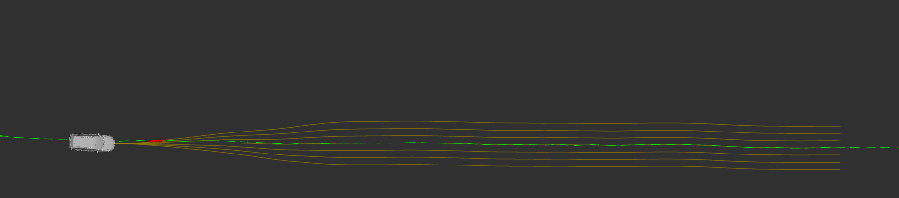
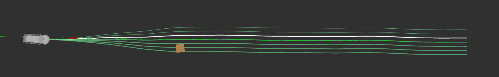
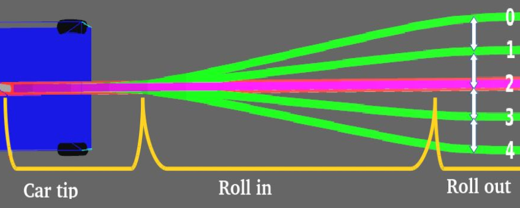
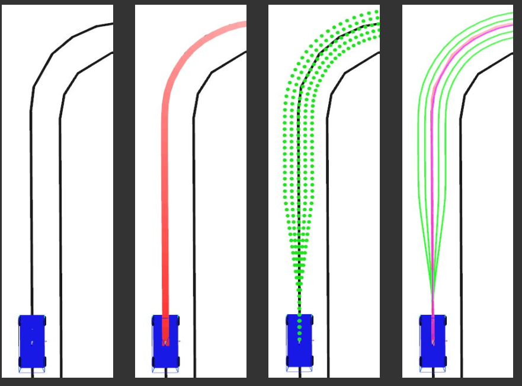
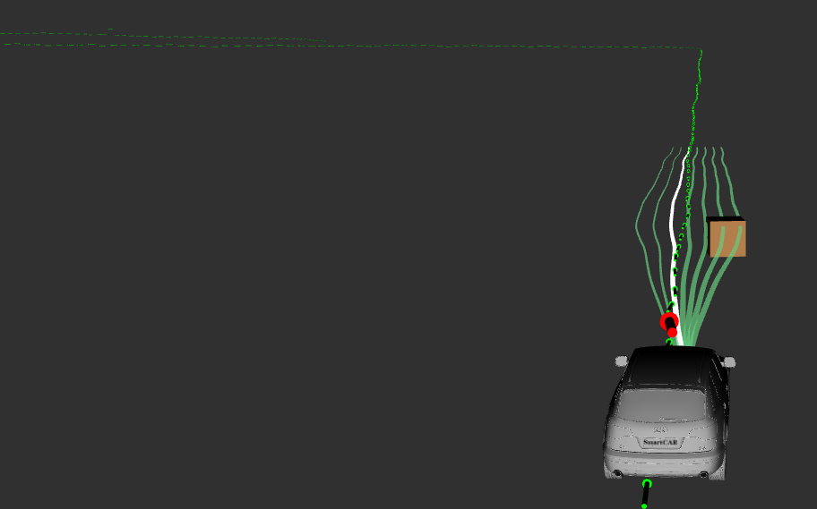
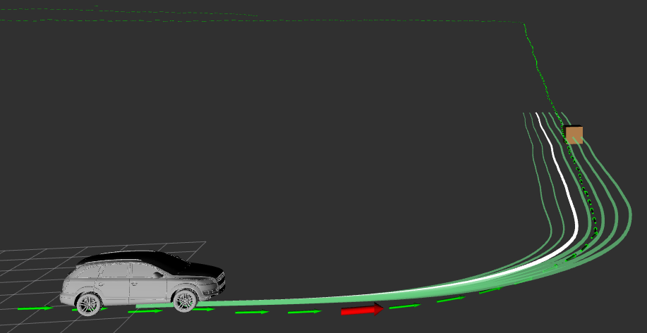
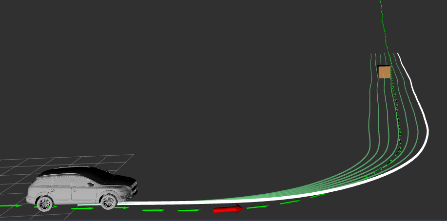

## 基于采样的局部规划与避障算法

### 一、引言
目前为系统添加了局部路径规划模块，结合之前做的视觉激光雷达信息融合模块，系统需要进一步对避障部分进行处理。

局部路径规划总的来说是在全局路径规划模块下，结合避障信息重新生成局部路径的模块，上层的全局路径规划确定了A到B的一个全局路径，不过轨迹跟踪模块(比如 pure persuit)实际进行跟踪的不能是这个直接生成的全局路径，因为系统实际工作可能会有其他情况发生，轨迹跟踪模块实际跟踪的是结合障碍物信息的局部路径。

局部路径规划算法有好多种，例如人工势场法，动态窗口法等，

这里要介绍的是DARPA比赛中斯坦福大学Stanley自动驾驶系统所使用局部路径规划算法，是一种基于采样的局部路径规划算法，该算法在autoware的op_planner模块也有使用，本文主要是基于autoware的op_planner模块进行介绍。

整体来看op_planner的local_planner主要分为两部分：Rollouts Generator 和 Rollouts Evaluator,前者根据全局中心路径生成一系列平滑的候选局部路径，后者结合障碍物信息和其他因素计算各个Rollout的代价Cost，从而选出最终平滑的，无障碍的局部路径。

Rollouts 的含义就是根据中心全局路径生成的一些列候选局部路径。如下图所示：



中间的绿线是全局路径规划模块生成的全局路径，棕色线是生成的一系列候选局部路径。

在有障碍物存在的情况下，经过计算每个rollout的代价Cost,选出最优的路径如下所示：



其中，白线就是评估后得到的最优的局部路径。

下面针对local_planner的两个主要部分的算法Rollouts Generator 和 Rollouts Evaluator进行简要分析，相关代码已经同步到我的github,位于planning/local_planner

[SmartCAR](https://github.com/sunmiaozju/smartcar)

参考论文：
Open Source Integrated Planner for Autonomous Navigation in Highly Dynamic Environments

完整的论文地址：
[github-smartcar/planning/local_planner/docs/Open Source Integrated Planner for Autonomous Navigation in Highly Dynamic Environments.pdf](https://github.com/sunmiaozju/smartcar/tree/dev_sunm/planning/local_planner/docs)

### 二、Rollouts Generator

模块的输入信息是车辆当前位置，全局规划路径，rollouts数量，规划距离等等

输出的是n条平滑的，起点位于车辆当前位置，终点位于最大规划距离的候选局部规划轨迹。

根据论文中的描述，rollout被划分为了三个部分：Cartip，Rollin, Rollout，如下图所示：



cartip部分从车辆中心点到水平采样的起点，这部分的长度决定了车辆切换不同轨迹的平滑程度。

rollin部分从水平采样的起点到平行采样的起点，这部分的长度和车辆速度密切相关，车辆速度越快，rollin部分应越长，使得轨迹更加平滑。

rollout部分从平行采样的起点到最大规划距离，这部分里每一条rollout都是平行的，相隔距离由rollout_density来确定。

生成rollouts的算法主要包括三个部分：1、截取全局路径，长度为最大局部路径规划距离。2、针对截取的全局路径进行点采样。3、平滑得到的采样点，生成最终候选轨迹。具体如下图所示：



主循环函数主要的内容就是extractPartFromTrajectory()和generateRunoffTrajectory()。具体代码细节可以参考github.

```c++
/**
 * @description: 主循环函数
 * @param {type}
 * @return:
 */
void RolloutGenerator::run()
{
    ros::Rate loop_rate(100);
    while (ros::ok())
    {
        ros::spinOnce();
        if (currentPose_flag && globalPaths.size() > 0)
        {
            globalPathSections.clear();
            for (size_t i = 0; i < globalPaths.size(); i++)
            {
                centralTrajectorySmoothed.clear();
                // 截取全局规划路径
                extractPartFromTrajectory(globalPaths[i], current_pose, 50,
                                          PlanningParams.pathDensity, centralTrajectorySmoothed);
                globalPathSections.push_back(centralTrajectorySmoothed);
            }
            std::vector<UtilityNS::WayPoint> sampled_points;
            // 生成候选rollouts
            generateRunoffTrajectory(globalPathSections,
                                     current_pose,
                                     speed,
                                     PlanningParams.microPlanDistance,
                                     PlanningParams.carTipMargin,
                                     PlanningParams.rollInMargin,
                                     PlanningParams.speedProfileFactor,
                                     PlanningParams.pathDensity,
                                     PlanningParams.rollOutDensity,
                                     PlanningParams.rollOutNumber,
                                     PlanningParams.smoothingDataWeight,
                                     PlanningParams.smoothingSmoothWeight,
                                     PlanningParams.smoothingToleranceError,
                                     rollOuts,
                                     sampled_points);
}
```


### 三、Rollouts Evaluator

这部分的输入是之前生成的Rollouts以及感知模块得到的障碍物信息，输出的是最优的局部规划路径。

这里使用三个代价函数来评估不同的局部路径:priority cost, collision cost 和 transition cost.

priority cost 代表中间的局部轨迹优先级是最高的，在没有障碍物的情况下，优先选择中间的局部轨迹，如下所示：
```c++
// cal priority cost
for (int i = 0; i < rollouts.size(); i++)
{
    tc.index = i;
    tc.relative_index = i - params.rollOutNumber / 2;
    tc.distance_from_center = params.rollOutDensity * tc.relative_index;
    tc.priority_cost = fabs(tc.distance_from_center);
}
```

transition cost 限制了车辆不会跳跃多个局部路径，确保了车辆前进路径的平滑性。根据车辆当前所处的局部路径位置，转换到临近车道代价较小，转换到较远车道代价较大。如下所示：

```c++
// cal transition cost
for (int ki = 0; ki < trajectoryCosts.size(); ki++)
    trajectoryCosts[ki].transition_cost = fabs(params.rollOutDensity * (currIndex - ki));
```

collision cost 主要分为lateral_cost 和 longitudinal_cost，前者代表局部轨迹距离障碍物的水平距离，后者代表局部轨迹距离最近障碍物的垂直距离

collision cost计算的相关代码细节位于函数 calLateralAndLongitudinalCostsStatic()
```c++
for (int i = 0; i < rollOuts.size(); i++)
{
    for (int k = 0; k < contourPoints.size(); k++)
    {
        UtilityNS::RelativeInfo contour_rela_info;

        UtilityNS::getRelativeInfo(centerPath, contourPoints[k], contour_rela_info);

        if (contour_rela_info.iFront == 0 && contour_rela_info.iBack == 0 && contour_rela_info.direct_distance > 3)
            continue;

        // 计算当前障碍物点到车辆位置的沿着中心轨迹的距离
        double longitudinalDist = getTwoPointsDistanceAlongTrajectory(centerPath, car_rela_info, contour_rela_info);
        if (contour_rela_info.iFront == 0 && longitudinalDist > 0)
            longitudinalDist = -longitudinalDist;
        double distance_from_center = trajectoryCosts[i].distance_from_center;
        lateralDist = fabs(contour_rela_info.perp_distance - distance_from_center) * 2;

        if (lateralDist < 2 && longitudinalDist < params.minFollowingDistance && longitudinalDist >= -critical_long_back_distance)
            trajectoryCosts[i].bBlocked = true;

        if (lateralDist != 0)
            trajectoryCosts[i].lateral_cost += 1.0 / lateralDist;

        if (longitudinalDist != 0)
            trajectoryCosts[i].longitudinal_cost += 1.0 / longitudinalDist;

        if (longitudinalDist >= -critical_long_back_distance && longitudinalDist < trajectoryCosts[i].closest_obj_distance)
            trajectoryCosts[i].closest_obj_distance = longitudinalDist;
    }
}
```

### 四、实际效果

运行节点：
```
roslaunch local_planner rollout_generator.launch
roslaunch local_planner local_trajectory_generator.launch
roslaunch waypoint_follower pure_persuit.launch
```
启动rviz，订阅相关话题可以看到如下效果：







其中，白色线代表最优的局部路径规划轨迹

### 五、总结

本文简要介绍了autoware中的op_planner的局部路径规划算法，对关键的算法步骤进行简要说明，这部分模块可以实现基本的避障功能，相比于其他的局部路径规划算法，本文介绍的基于采样的局部路径规划实现简单，实时性较高，可以在实际部署运行。
